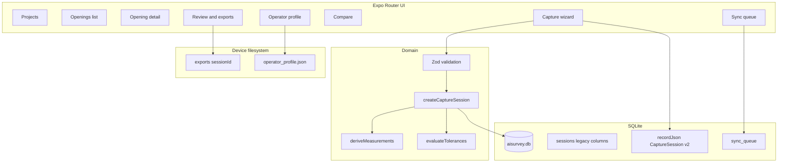

# Opening Capture — Mobile Application Specification

This document describes how the **aisurvey-mobile** Expo app works today: architecture, data model, user flows, exports, sync behavior, and how to run and verify it. It complements the product/design MVP doc [`docs/superpowers/specs/2026-05-08-opening-capture-design.md`](../superpowers/specs/2026-05-08-opening-capture-design.md) and operator clarification [`docs/superpowers/specs/operator-identity-mvp.md`](../superpowers/specs/operator-identity-mvp.md).

**Canonical codebase path:** `.worktrees/opening-capture-mvp/aisurvey-mobile/` (relative to AISurvey repo root).

---

## 1. Purpose and scope

The app implements an **offline-first** workflow to:

1. Organize work under **projects** and **openings**.
2. Run a **capture session** per opening: required photos (camera or gallery), measurements (mm), optional depth/video artifacts, manual plumb/level notes and optional annotation photos, GPS snapshot when permitted, device snapshot.
3. Compute **derived measurements** and **PASS / WARN / FAIL** tolerance results from thresholds frozen at capture time (project defaults + optional opening overrides + per-session numeric edits; warn band multiplier from project only).
4. **Review** sessions, add **sign-off**, generate **PDF + JSON + CSV** from one canonical `CaptureSession`.
5. **Compare** two sessions for the same opening (measurement deltas + overall status display).
6. Surface a **sync queue** and optional HTTP upload stub when configured.

**Out of scope in code today:** multi-tenant org model, real SSO, multipart media upload pipeline, LiDAR-native depth APIs, “supersedes session X” graph, PRD-wide AI/AR/digital twin (see [`docs/prd-rollout/platform-foundation.md`](../prd-rollout/platform-foundation.md)).

---

## 2. Architecture overview



- **Single source of truth for exports:** `CaptureSession` (`schemaVersion === 2`), serialized to `sessions.recordJson` when present.
- **Backward compatibility:** Rows without valid `recordJson` are **hydrated** from legacy JSON columns with sensible defaults (see [`sessionsRepo`](../../.worktrees/opening-capture-mvp/aisurvey-mobile/src/db/sessionsRepo.ts)).

---

## 3. Technology stack

| Layer | Choice |
|-------|--------|
| Runtime | Expo SDK ~54, React Native 0.81, React 19 |
| Navigation | expo-router (file-based routes) |
| Local DB | expo-sqlite (`aisurvey.db`, WAL) |
| Validation | Zod |
| Camera | expo-camera (`CameraView`) |
| Photos / video pick | expo-image-picker |
| Location | expo-location |
| Device / app info | expo-device, expo-constants |
| PDF | expo-print (`printToFileAsync`) |
| Files | expo-file-system **legacy** API for read/write compatible paths |
| Sharing | expo-sharing |
| QR in PDF | `qrcode` (data URL in HTML) |

---

## 4. Navigation map (screens)

| Route | File | Role |
|-------|------|------|
| `/` | `app/index.tsx` | Redirect to `/projects` |
| `/projects` | `app/projects/index.tsx` | Create/list projects; link Sync queue, Operator profile |
| `/projects/[projectId]/edit` | `app/projects/[projectId]/edit.tsx` | Edit project name + site metadata |
| `/projects/[projectId]/openings` | `app/projects/[projectId]/openings.tsx` | Create/list openings; search; status badge; shortcuts |
| `/openings/[openingId]/index` | `app/openings/[openingId]/index.tsx` | Opening hub + session timeline → review |
| `/openings/[openingId]/edit` | `app/openings/[openingId]/edit.tsx` | Edit label, location notes, type |
| `/openings/[openingId]/capture` | `app/openings/[openingId]/capture.tsx` | Capture wizard → creates session → review |
| `/openings/[openingId]/tolerance` | `app/openings/[openingId]/tolerance.tsx` | Opening-level tolerance overrides (nullable = inherit) |
| `/openings/[openingId]/compare` | `app/openings/[openingId]/compare.tsx` | Pick two sessions; deltas + status colors |
| `/sessions/[sessionId]/review` | `app/sessions/[sessionId]/review.tsx` | Metadata, thumbnails, sign-off, exports |
| `/sync` | `app/sync/index.tsx` | Sync queue list + Retry |
| `/settings/operator` | `app/settings/operator.tsx` | Device-local default operator string |

Stack registration: [`app/_layout.tsx`](../../.worktrees/opening-capture-mvp/aisurvey-mobile/app/_layout.tsx).

---

## 5. Data persistence

### 5.1 Base schema

Applied at open via [`src/db/schema.ts`](../../.worktrees/opening-capture-mvp/aisurvey-mobile/src/db/schema.ts): `projects`, `openings`, `sessions` (minimal columns + FKs).

### 5.2 Migrations

[`src/db/migrations.ts`](../../.worktrees/opening-capture-mvp/aisurvey-mobile/src/db/migrations.ts) adds:

**projects**

- `defaultMaxOutOfSquareMm`, `defaultMaxWidthRangeMm`, `defaultMaxHeightRangeMm` (defaults for new projects via repo constants).
- `defaultWarnBandMultiplier` (WARN band over PASS limits).
- `siteAddress`, `siteNotes` (optional site metadata).

**openings**

- `locationNotes`, `openingType`.
- `overrideMax*` nullable reals for per-opening tolerance overrides.

**sessions**

- `recordJson` — full `CaptureSession` JSON when written by current app.

**sync_queue**

- `sessionId` PK, `openingId`, `enqueuedAt`, `status` (e.g. `pending`).

### 5.3 Opening list status

[`listOpenings`](../../.worktrees/opening-capture-mvp/aisurvey-mobile/src/db/openingsRepo.ts) includes scalar subquery **`latestSessionStatus`**: `sessions.overallStatus` from the newest session by `createdAt`. Display **`none`** when no sessions exist.

---

## 6. Canonical domain model (`CaptureSession`)

Defined in [`src/domain/models.ts`](../../.worktrees/opening-capture-mvp/aisurvey-mobile/src/domain/models.ts). Highlights:

- **Measurements:** width top/mid/bottom, height left/center/right; optional depth L/R; optional notes; optional **`annotationRefs`** (URIs, e.g. plumb/level evidence photos).
- **Derived:** nominal width = **mid**, nominal height = **center**; min/max ranges; out-of-square deltas `|top−bottom|`, `|left−right|` (see [`deriveMeasurements.ts`](../../.worktrees/opening-capture-mvp/aisurvey-mobile/src/domain/deriveMeasurements.ts)).
- **Tolerance:** three checks — width range, height range, out-of-square vs PASS limits; each **PASS / WARN / FAIL** using `warnBandMultiplier` on project (`WARN` if value ≤ limit × multiplier). Overall status = worst of the three.
- **Snapshots:** `projectSnapshot` (name + optional site fields), `openingSnapshot` (label, location notes, type).
- **Sign-off & exports:** optional `signOff`; optional `exports` paths after generation.

Session creation: [`createCaptureSession`](../../.worktrees/opening-capture-mvp/aisurvey-mobile/src/domain/sessionFactory.ts) validates draft via Zod, computes derived + tolerance results, sets `syncState: "local_only"`, `createdAt: endedAt` (aligned with legacy column usage).

---

## 7. Tolerance resolution

[`resolveToleranceConfig`](../../.worktrees/opening-capture-mvp/aisurvey-mobile/src/domain/resolveToleranceConfig.ts):

- Numeric PASS limits: opening override if non-null, else project default.
- **`warnBandMultiplier`:** **always** from project (not overridable per opening in current UI).

Capture screen allows editing the three PASS limits for **this session only**; multiplier stays fixed from project.

---

## 8. Capture flow (end-to-end)

1. User opens **Opening detail** or **Capture** shortcut.
2. Loads opening + project → resolves effective tolerance → seeds draft limits.
3. Collects operator (prefilled from [`operatorStore`](../../.worktrees/opening-capture-mvp/aisurvey-mobile/src/settings/operatorStore.ts) when set).
4. **Photos:** per required kind — **Camera** (modal `CameraView`) or **Gallery**.
5. Optional depth image URI, optional video URI (library).
6. Measurements + notes; plumb/level text + optional annotation photos (camera/gallery) → `annotationRefs`.
7. On submit: validates draft → reads GPS once → builds `CaptureSession` → **`insertSession`**.
8. **`insertSession`** writes denormalized columns + `recordJson`, inserts **`sync_queue`** row (`status: pending`).
9. Navigate to **Review**.

**Note:** `CaptureSession.syncState` remains **`local_only`** at insert while **`sync_queue`** tracks pending upload intent — see §11.

---

## 9. Review, sign-off, exports

- UI loads session via **`getSessionById`**: prefers **`recordJson`** if `schemaVersion === 2`.
- Sign-off updates persisted record via **`updateSessionRecord`** (rewrites `recordJson` and mirrors columns).
- **Exports:** [`writeSessionExports`](../../.worktrees/opening-capture-mvp/aisurvey-mobile/src/exports/writeExportFiles.ts) writes JSON + CSV under `documentDirectory/exports/{sessionId}/`, builds HTML for PDF (embedded images + QR + sign-off block), copies PDF into same folder; then saves paths on session.

Export formats:

- **JSON:** envelope + session ([`jsonExport.ts`](../../.worktrees/opening-capture-mvp/aisurvey-mobile/src/exports/jsonExport.ts)).
- **CSV:** key/value rows including metadata, derived, tolerance rows, sign-off flags ([`csvExport.ts`](../../.worktrees/opening-capture-mvp/aisurvey-mobile/src/exports/csvExport.ts)).
- **PDF:** HTML → `expo-print` ([`pdfExport.ts`](../../.worktrees/opening-capture-mvp/aisurvey-mobile/src/exports/pdfExport.ts)).

---

## 10. Compare flow

[`compare.tsx`](../../.worktrees/opening-capture-mvp/aisurvey-mobile/app/openings/[openingId]/compare.tsx): user picks session A/B; loads full sessions; shows measurement deltas (B − A) and overall PASS/WARN/FAIL with color styling.

---

## 11. Sync queue and HTTP stub

- **Queue:** populated on every **`insertSession`** (replace row per `sessionId`).
- **Retry:** [`sync/index.tsx`](../../.worktrees/opening-capture-mvp/aisurvey-mobile/app/sync/index.tsx) calls **`retrySyncQueueMarkQueued`** then **`attemptUploadSession`** if session loads.

[`attemptUploadSession`](../../.worktrees/opening-capture-mvp/aisurvey-mobile/src/sync/sessionUploader.ts):

- If **`EXPO_PUBLIC_SYNC_API_BASE`** is unset → returns structured failure message (local-only).
- If set → `PUT {base}/v1/sessions/{sessionId}` with `{ session }` JSON.

Contract details: [`docs/prd-rollout/sync-upload-api.md`](../prd-rollout/sync-upload-api.md).

**Semantic gap to be aware of:** session row **`syncState`** is not flipped to `queued`/`synced` on insert or successful PUT in current MVP — queue table drives operator-facing retry; aligning `sessions.syncState` with backend lifecycle is a future improvement.

---

## 12. Permissions and plugins

Configured in [`app.json`](../../.worktrees/opening-capture-mvp/aisurvey-mobile/app.json):

- **expo-camera** — camera (and microphone permission string for optional video scenarios).
- **expo-location** — when-in-use location strings.

Gallery access uses **image-picker** permission prompts at runtime.

---

## 13. How to run the app

### 13.1 Prerequisites

- **Node.js** (LTS recommended, e.g. 20.x+).
- **npm** (ships with Node).
- For device testing: **Expo Go** or dev builds; **Android Studio** / **Xcode** as needed for emulators.

### 13.2 Install

From the app directory:

```bash
cd .worktrees/opening-capture-mvp/aisurvey-mobile
npm install
```

### 13.3 Start Metro / Expo

```bash
npm start
# or
npx expo start
```

Then press **`i`** (iOS simulator), **`a`** (Android emulator), or scan QR with **Expo Go** on a physical device.

Platform-specific shortcuts:

```bash
npm run android
npm run ios
npm run web
```

> **Web:** Camera, SQLite, and some native modules may be limited or behave differently; **iOS/Android are the intended targets** for MVP validation.

### 13.4 Optional: sync endpoint

Create `.env` or use your shell (Expo picks up **`EXPO_PUBLIC_*`** at bundle time):

```bash
set EXPO_PUBLIC_SYNC_API_BASE=https://your-api.example.com
npx expo start
```

Implement server per [`sync-upload-api.md`](../prd-rollout/sync-upload-api.md). Changing env requires restarting Metro so variables are embedded.

### 13.5 Repository layout reminder

If your checkout only has the main branch, ensure the **worktree** path exists or merge `feat/opening-capture-mvp` (or equivalent) so `.worktrees/opening-capture-mvp/aisurvey-mobile` is present.

---

## 14. Testing and quality gates

Run from `aisurvey-mobile`:

| Command | Purpose |
|---------|---------|
| `npm test` | Vitest unit tests (`tests/*.test.ts`) — domain validation, tolerances, session factory, compare deltas, etc. |
| `npx tsc --noEmit` | TypeScript compile check |

There is **no** Detox/E2E suite in-repo yet; manual smoke per §13 on device is recommended after changes.

---

## 15. Related documents

| Document | Topic |
|----------|--------|
| [`2026-05-08-opening-capture-design.md`](../superpowers/specs/2026-05-08-opening-capture-design.md) | Approved MVP product/design spec |
| [`operator-identity-mvp.md`](../superpowers/specs/operator-identity-mvp.md) | Operator vs SSO clarification |
| [`sync-upload-api.md`](../prd-rollout/sync-upload-api.md) | Draft HTTP contract for sync |
| [`platform-foundation.md`](../prd-rollout/platform-foundation.md) | Post-MVP platform backlog |
| [`ai-ar-phase.md`](../prd-rollout/ai-ar-phase.md) | Post-MVP AI/AR backlog |

---

## Document history

| Date | Change |
|------|--------|
| 2026-05-09 | Initial full application specification + run/test section |
